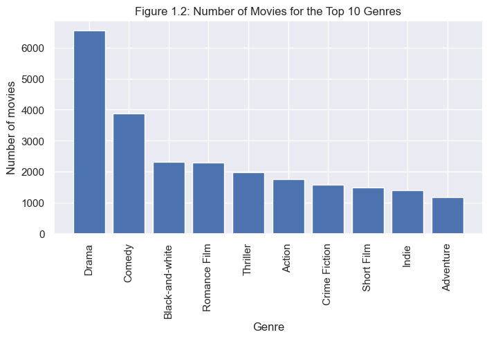
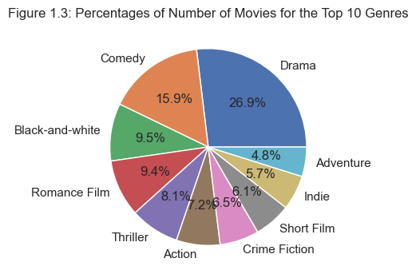
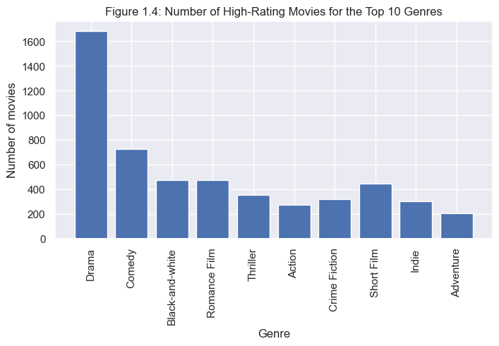

# 1. Genre 
In the realm of movies, genres play a crucial role in defining the stylistic and thematic elements that shape a film's identity. Unlike strict boundaries, many movies embrace a blend of genres, creating a rich tapestry of storytelling that transcends traditional categorizations. From action-packed adventures with a touch of romance to thought-provoking science fiction infused with elements of comedy, the interplay of multiple genres adds layers of complexity and intrigue to cinematic experiences. Whether it's a thrilling action-comedy, a romantic fantasy epic, or a crime drama with elements of mystery, the fusion of genres allows filmmakers to craft narratives that appeal to a diverse audience, offering a dynamic and ever-evolving landscape within the world of cinema.

In our evaluation of cinematic quality, the role of genres in influencing ratings emerges as a noteworthy consideration. The objectives of this analysis encompass the exploration of various research questions:

- Identification of the top 10 most prolific genres in the history of cinema.
- Evaluation of the proportion of exemplary films within the aforementioned 10 most prolific genres, defined here as those with a rating of 7 or higher.
- Examination of the intersection between genres and the temporal variable, aiming to identify "golden eras" marked by periods with the highest number of highly-rated films within a specific genre. This will be accomplished through the visualization of highly-rated movie counts per decade.
- Scrutiny of genre combinations to discern noteworthy amalgamations during specific time periods. This aspect of the analysis will involve the generation of a bar chart illustrating the ratio of highly-rated movies relative to each decade.

## 1.1 Top 10 Most Prolific Genres in the History of Cinema

Upon examination of the aforementioned graph, it becomes evident that there are over 700 genres, with a considerable portion having a minimal number of movies, rendering them inconsequential for our analytical purposes. Consequently, we have elected to narrow our focus to the top ten genres, as they not only serve as more representative subsets but also encapsulate the majority of films within our dataset.

Given that our criterion for categorizing "good" movies hinges on those with a rating surpassing 7, we proceed to implement a filtering mechanism. This entails narrowing our focus exclusively to movies meeting this specific high-rating threshold. By concentrating on this subset of films, we aim to glean more targeted insights into the characteristics and trends associated with movies that align with the established criteria for excellence.

The graphical representation highlights the prominence of the drama genre, possessing the highest count of highly-rated movies, a figure significantly surpassing other genres. However, it is imperative to consider that the sheer abundance of drama films in the dataset could contribute to this observation. To delve deeper into the matter, we meticulously examine the ratio of high-rated movies to the total number of movies within each genre, providing a more nuanced perspective on the prevalence of quality content within the diverse genres.

The graph reveals noteworthy insights into the distribution of highly-rated movies across genres. Notably, short films exhibit the highest ratio of highly-rated movies to the total number of short films, positioning it at the forefront. Drama, despite its prominence in sheer numbers, takes the second position in this ratio analysis. Conversely, adventure and action genres exhibit the lowest ratios, indicating a comparatively lower prevalence of highly-rated movies within these genres. This nuanced examination contributes to a more comprehensive understanding of the quality distribution across various film genres.

## 1.2 Trend of Genres 

Subsequently, we incorporate the temporal variable into our analysis to explore whether certain genres exhibit a notable concentration of highly-rated movies during specific time periods. The objective is to discern if there are temporal intervals wherein a particular genre experiences a significantly higher count of highly-rated movies compared to other periods. This temporal analysis aims to uncover patterns and trends in the distribution of high-quality movies within individual genres across different epochs.

'\n\n\n\n

\n'

The graphical representation highlights two notable surges in the number of highly-rated movies throughout history: one during the 1930s and another in the 2000s.  During these intervals, there is a pronounced surge in the number of movies receiving high ratings. Intriguingly, in the aftermath of both periods, there is a noticeable decline, coinciding with two significant economic crises—the Great Depression in the 1930s and the global financial crisis of 2008. The observed correlation between economic downturns and fluctuations in the production and reception of high-quality movies prompts an exploration into the intricate dynamics at play during times of economic instability. Unraveling the contextual factors influencing these trends can provide valuable insights into the evolving landscape of the film industry across different historical epochs.

It comes as no surprise that a significant proportion of highly-rated movies are in black-and-white, with a notable concentration within the drama genre. This observation underscores the enduring appeal of the black-and-white aesthetic in conveying the nuanced themes often associated with dramatic narratives. Furthermore, within the realm of black-and-white films, the comedy and romance genres emerge as particularly prominent, constituting the majority of high-rated movies. This alignment suggests a unique intersection of visual style and storytelling elements that contribute to the success and acclaim of black-and-white comedies and romances. A more in-depth exploration of these specific films can shed light on the distinctive qualities that make them stand out within the broader landscape of high-quality cinema.

Delving into the significant surge observed in the 2000s, we aim to meticulously examine the intricate effects resulting from combinations of genres during this prolific period. By scrutinizing the interplay between different genres within this temporal frame, we seek to unravel patterns, preferences, and potential synergies that contributed to the remarkable increase in the number of highly-rated movies. This focused analysis on genre combinations promises to unveil insights into the evolving tastes, creative trends, and collaborative dynamics that defined the cinematic landscape during this particular era, enriching our understanding of the multifaceted factors influencing the success of movies.

From the comprehensive analysis presented above, a discernible trend emerges, indicating that the drama genre has consistently dominated the cinematic landscape. This dominance is reflected in both the largest number of total movies across all genres. The enduring popularity and prevalence of drama underscore its universal appeal, serving as a versatile and enduring vehicle for storytelling that resonates with diverse audiences. As we continue to explore the intricacies of genre dynamics, the prominence of drama stands as a testament to its enduring significance within the ever-evolving world of cinema.

# 2. Duration 

## 2.1 Removing outliers

The duration of a movie, a fundamental element in cinematic storytelling, serves as a crucial factor influencing the overall viewing experience and perceived quality. Film durations vary widely, ranging from concise short films to sprawling epics. The impact of a movie's duration on its quality is a nuanced consideration that intertwines with storytelling techniques, pacing, audience engagement, and thematic depth. A well-crafted film can leverage its duration to immerse viewers in its narrative world, allowing for character development, plot intricacies, and emotional resonance. However, an excessively long or brief duration may pose challenges, potentially leading to pacing issues or insufficient exploration of complex themes. This intricate interplay between movie duration and quality underscores the significance of understanding how filmmakers navigate the temporal dimension to create compelling and impactful cinematic experiences.

Upon examination of the graph presented above, a noteworthy pattern emerges where a considerable number of films exhibit either exceptionally short or excessively long durations, exceeding 5000 minutes. To ensure the precision and reliability of our analysis, it is imperative to address these outliers. Eliminating such extreme values is essential for a more accurate representation of the dataset and will contribute to the robustness of our findings.

Additionally, it is pertinent to acknowledge that short films often have relatively brief durations, which could potentially skew our analysis of runtime for regular feature-length movies. Fortunately, a substantial portion of these short films falls within the category of outliers slated for removal. This strategic refinement of the dataset aims to enhance the integrity of our examination of movie durations and facilitate a more nuanced understanding of the temporal aspects within the cinematic landscape.

## 2.2 Regression Analysis

The preliminary regression analysis indicates a noteworthy trend where longer durations tend to correlate with higher average ratings. This initial observation prompts further investigation to validate and refine our understanding of the relationship between movie duration and audience ratings. While this finding suggests a positive association, additional factors such as genre, thematic content, and storytelling techniques may contribute to a more nuanced interpretation. Therefore, a more in-depth and comprehensive analysis is warranted to ensure a robust understanding of the intricate dynamics influencing movie ratings in relation to their durations.

Our analysis adopts a dual perspective, delineated by two distinct criteria. Firstly, the dataset is bifurcated based on ratings, with a division into two halves. Subsequently, the dataset is segregated based on duration, categorizing movies with a runtime exceeding 80 minutes as long-duration films. Two sets of t-tests are conducted to discern potential statistically significant differences: one examines the mean average duration between high-rating and lower-rating movies, while the other investigates the mean average rating between long-duration and shorter-duration movies. These parallel analyses offer a comprehensive exploration of the interplay between movie ratings, durations, and their potential impact on cinematic characteristics.

Conducting a t-test on the runtime variable is imperative to ascertain the presence of a statistically significant distinction between two subsets of movies based on their ratings. Specifically, this analysis aims to discern whether there exists a noteworthy difference in runtime duration between movies with ratings exceeding 7 and those with ratings below 7. By rigorously applying statistical methods, we endeavor to illuminate any discernible patterns or variations in movie runtimes associated with differing rating categories.

Based on the preceding analysis, it is evident that a statistically significant difference exists between the means of movie runtimes for those with ratings exceeding 7 and those with ratings below 7. The mean duration of high-rating movies is found to be 7.71% higher than that of their lower-rated counterparts. This finding suggests a notable variation in runtime characteristics between movies of distinct rating categories, emphasizing the potential influence of audience ratings on the temporal aspects of cinematic storytelling.

Based on the outcomes presented above, it is evident that a statistically significant difference exists in the means of average ratings between long-duration movies and shorter-duration movies. Specifically, long-duration movies exhibit a higher mean rating of 6.19, contrasting with the mean rating of 6.03 observed for shorter-duration movies. This finding underscores a notable association between the temporal extent of movies and audience ratings, suggesting that longer-duration films tend to garner higher average ratings compared to their shorter-duration counterparts.

# 3. Ethnic Diversity

Hollywood, and many major film studios around the world, has long faced criticism for the lack of racial diversity in its workforce both on and off the screens. In recent decades, there has also been a growing call for greater representation of racial minorities on the silver screen. [Figure 3.1] shows a quick exploratory analysis of the distribution of the number of ethnicities among cast members of each film between 1900 to 2009. As shown in the figure, the curve of films rated 7 or above is largely above that of films rated below. This suggests that highly rated films generally have more ethnically diverse casts than those lower rated, and cast ethnic diversity could be an interesting angle to further our investigation. 

## 3.1 Shifting Demographics: From Diverse Actors Pool To Diverse Casts

To set the stage, let's first take a look at how the ethnic demographics of actors has evolved globally over time. [Figure 3.2] shows that the 110-year history of film-making has witnessed a booming growth in the ethnic background of actors, with the trend accelarating after 1960s.

This fast diversifying shift in the acting workforce is reflected on the silver screen, through greater, though much more subdued, ethnic representation by the collective featuring of actors from different ethnic backgrounds in the same films.

In [Figure 3.3], for the first half of the century, nearly all films' casts have remained dominated by a single ethnicity, as both the average and the spread of the number of ethnicities among cast per film remained thin. As indicated by [Figure 3.1] above, the number of cast ethnicities follows power law distribution. [Figure 3.3] therefore measures its average across films in each decade by geometric mean.

Since 1960s, however, the average cast ethnicity has slowly climbed, reaching 2 for the first time in 1900s and reversing the trend slightly at the turn of the century. In the backdrop of a widening spread, more and more films have joined to cast more actors from different ethnic groups during this period, with half of the films featuring actors from at least 2 ethnic groups and a quarter of films featuring more than 3 since 1980s.

Although most films' casts have stayed ethnically homogeneous, there has always been some outlier films throughout history with much more ethnically diverse cast than their contemporaries, potentially paving the way for further diversification in the future.

## 3.2 Increasing Representation: Appreciated by Audience And Reflected in Rating?

History has shown that actors from increasingly diverse ethnic backgrounds are getting film roles and seen on the silver screen. However, does the audience consider a film with a more ethnically diverse cast a better film? To examine how ethnic diversity impacts a film's overall perceived quality by viewers and also how this impact has changed over time, we analyze the relationship between a film cast's ethnic diversity and its audience ratings. Tying into the concept of 'representation', the ethnic diversity of a film is measured by the total number of different ethnicities among actors in a film as seen directly by the audience on a movie screen. Film quality as perceived by the audience is captured by the overall weighted average of all user rating scores on IMDB. As the vast majority of films consist of actors with identical ethnicity until the 1950s, the analysis begins with the 1960s.

In general, there is a small but positive correlation between a film's cast ethnic diversity and rating. As shown in [Figure 3.4] at various levels, across decades, the more ethnically diverse the cast, the higher the film rating. 

This correlation, measured by the Pearson Correlation Coefficient, is the strongest at the diversity level where only films featuring actors from at least 3 different ethnic groups are considered. We therefore uses this as a threshold to split films into ethnically diverse and non-diverse groups to continue the analysis. This threshold makes sense because in most countries where there is one dominant ethnic group, 'diverse' should mean seeing at least two minority ethnic groups featured as well. This begs the question - does an ethnically diverse cast contribute to a more highly rated film? Let's dive in. 

## 3.3 Identifying Impact: Ethnically Diverse Cast Improves Film Rating?

After establishing a treatment group of ethnically diverse films and a control group of non-diverse films, their average ratings are compared in [Figure 3.5]. Notably, films with ethnically diverse cast are rated consistently higher, with the 95% confidence interval overlapping only in the 1970s and 2000s. 

An observational study is conducted to disect this claim. Logistic regression is carried out using data from both groups and takes observed confounders as features, including release date, countries, languages and genres. The regression model calculates each film's probability to have an ethnically diverse cast. Propensity matching is then performed in each decade, to pair match similar films from both groups. After removing covariates through pair matching, [Figure 3.6] reveals that the claim still stands, as ethnically diverse films consistently outperform non-diverse films in average rating. Hypothesis testing shows that the difference in average ratings is statistically significant in 3 of the 5 decades, which are highlighted in circles. This confirms that films with an ethnically diverse cast tend to be better-received by the audience, and ethnic diversity among cast members contributes to higher ratings.

However, there exists an obvious downward trend for both groups, with the average rating of ethnically diverse films decreasing faster. This does not necessarily mean that audience appreciates ethnic diversity less over time. As evidenced by [Figure 3.7], there is a fast-paced growth in the number of ethnically diverse films released over the decades. The decline in rating of ethnically diverse films coincides with this growth. As this number approaches and eventually surpasses in the last 2 decades the number of ethnically non-diverse films in the previous decade, the average rating of ethnically diverse films closes in on that of non-diverse ones. This could potentially be because in the earlier decades, few ethnically diverse films are made, and they generally end up well-received and highly rated. This possibly motivates movie studios to produce more films featuring diverse casts and with increasing volume, the average rating begins to converge to the average rating representative of the true population mean overall. This could mean that despite recent laudable calls in the public for greater diversity on the film set, history has shown that ethnic diversity alone does not translate to higher rating.

# 4. Star Actors 
# 4.1 Does star power translate to higher ratings? How has the impact of stars evolved over time in movie ratings?
The correlation between star power and ratings in the movie industry has long been a subject of fascination. Over the years, the influence of A-list actors and actresses on the success of a film has undergone a significant evolution. The captivating question persists: does the presence of renowned stars inherently lead to higher ratings? 
## Star-Studded Success: Unraveling the Influence of Actors on Movie Ratings
We want to understand the relationship between Star Actors and movies ratings, for that, we perform a Linear regression to see how each Actor Contributes to the Movie Ratings

Using only actors who played in at least 35 movies, by doing so , we isolate Actors with a real precense in the industry.

By keeping only coefficient with p-values <0.05 , we ensure that the data is Significant and that the results are meaningfull  : 

Before any further analysis, It's important to mention that the Linear regression had an R-squared of only 0.1 , meaning that only using actors explain quite badly the ratings of movies, However, the regression found 14 actors with a significant Impact on movies ratings. 

Movies featuring actors like Bette Davis or Mel Blanc experience a nearly one-point boost in their ratings due to their participation.

